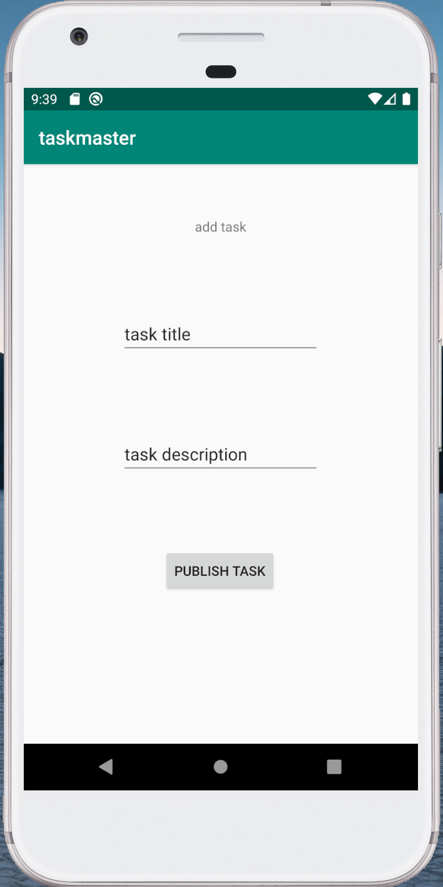
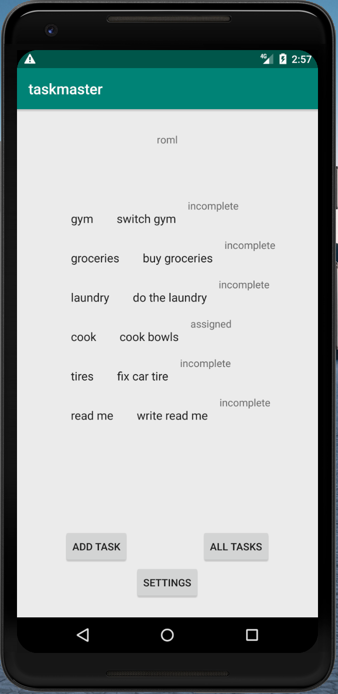

# Task App

## Description
My first Andriod app! The classic task manager app in Java built with Andriod Studio.  Allows users to set and save a username, add task titles along with a description.  Early version utilizes grouped radio buttons with hardcoded tasks.  Upon click of individual task, the user is taken to a detail page with task information displayed.  Second iteration implements a RecyclerView in addition to fragments.  Implements Room data storage.

## Screen Shots
> 
> 
> 
> 
 
## Daily Change Log
- 2/11 Created index, add task, and all tasks page.
- 2/12 Created detail, and setting page that takes in a supplied username and stores it locally.
- 2/13 Implemented recycler view and fragments for main page.
- 2/19 Implement Room
