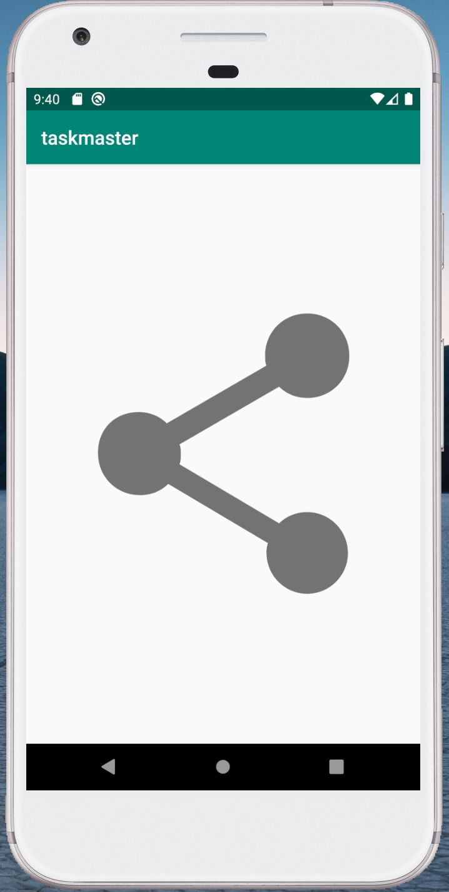

# Task App

## Description
My first Andriod app! The classic task manager app in Java built with Andriod Studio.  Allows users to set and save a username, add task titles along with a description.  Early version utilizes grouped radio buttons with hardcoded tasks.

## Screen Shots
> 
> 
> 
 
## Daily Change Log
- 2/11 Created index, add task, and all tasks page
- 2/12 Created detail, and setting page that takes in a supplied username and stores it locally.
