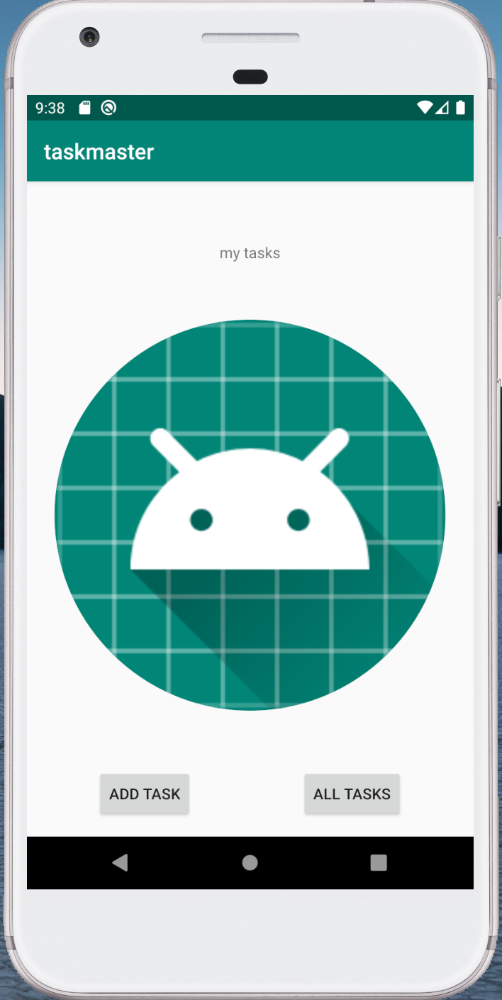

# Task App

## Description
My first Andriod app! The classic task manager app in Java built with Andriod Studio.  Allows users to set and save a username, add task titles along with a description.  Early version utilizes grouped radio buttons with hardcoded tasks.  Upon click of individual task, the user is taken to a detail page with task information displayed.  Second iteration implements a RecyclerView in addition to fragments.  Implements Room data storage.  Later versions implement cloud data storage using Amplify to generate boilerplate code.  Users are able to sign up or login to the application using Cognito.  Features notifications drop down.  Intent filters allow users to share a photo from another with the capability to upload the photo.  The task detail page will show the location where the task was created if available.  

## Screen Shots
> 
> 
> 
> 
> 
> 
 
## Daily Change Log
- 2/11 Created index, add task, and all tasks page.
- 2/12 Created detail, and setting page that takes in a supplied username and stores it locally.
- 2/13 Implemented recycler view and fragments for main page.
- 2/19 Implement Room
- 2/21 Refactor previous work and implement scalable cloud data storage
- 2/25 Implement Coginito user login, sign up, and log out flow.
- 3/2 Add s3 storage
- 3/2 Add notifications.
- 3/3 Implement feature that allows user to share a photo from another with the capability to upload the photo.
- 3/4 Add location data using Google API and include location when task is created.